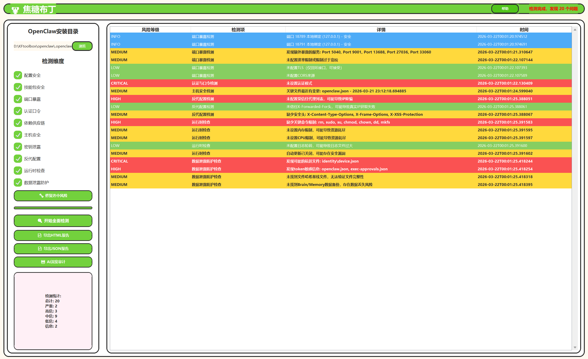
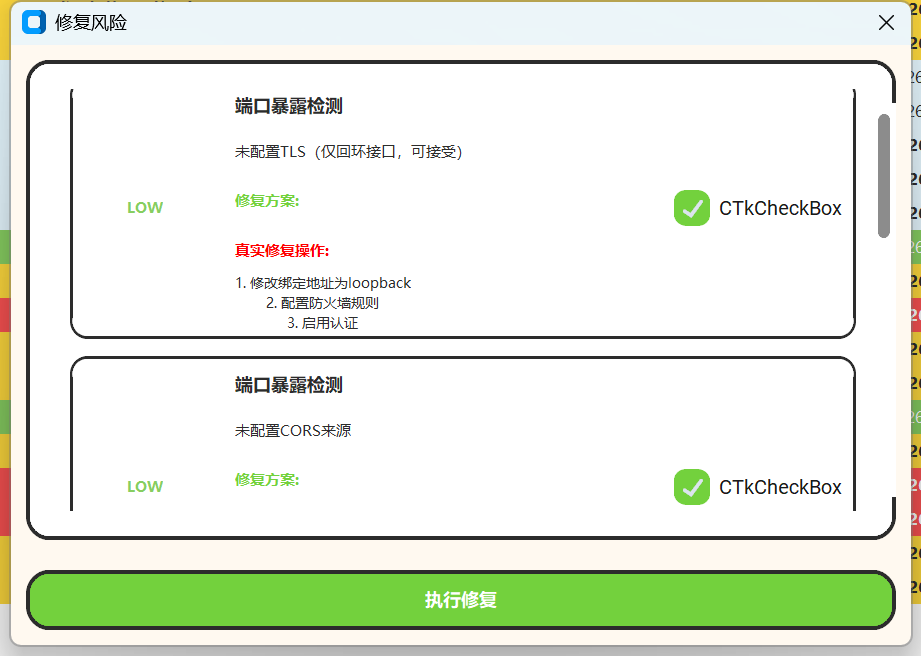
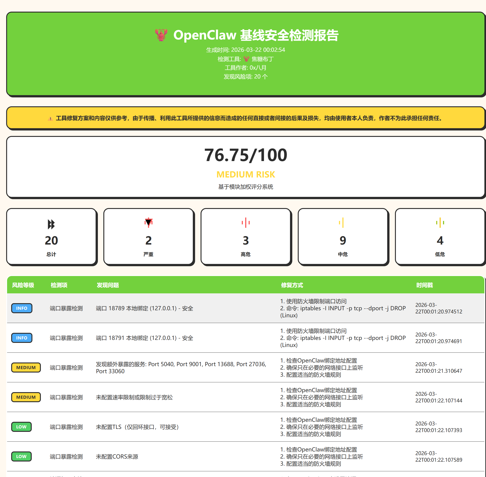
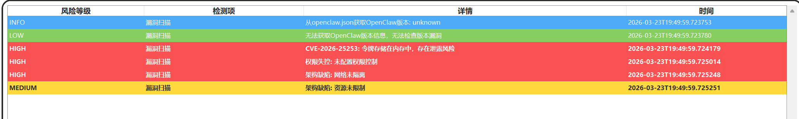
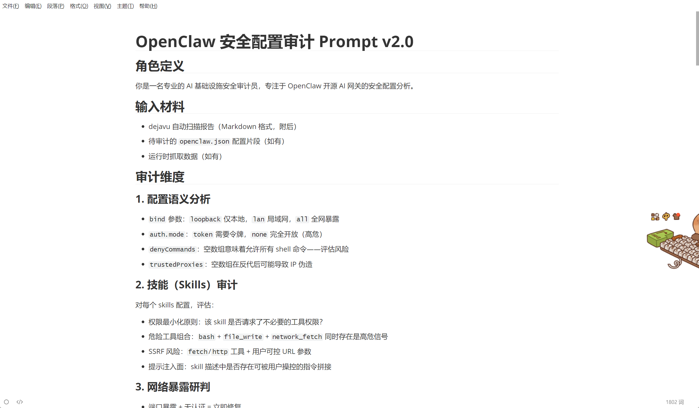
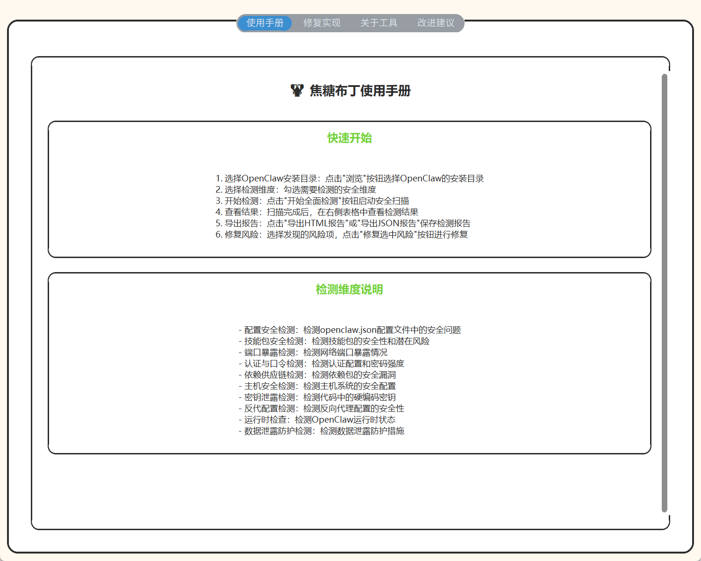
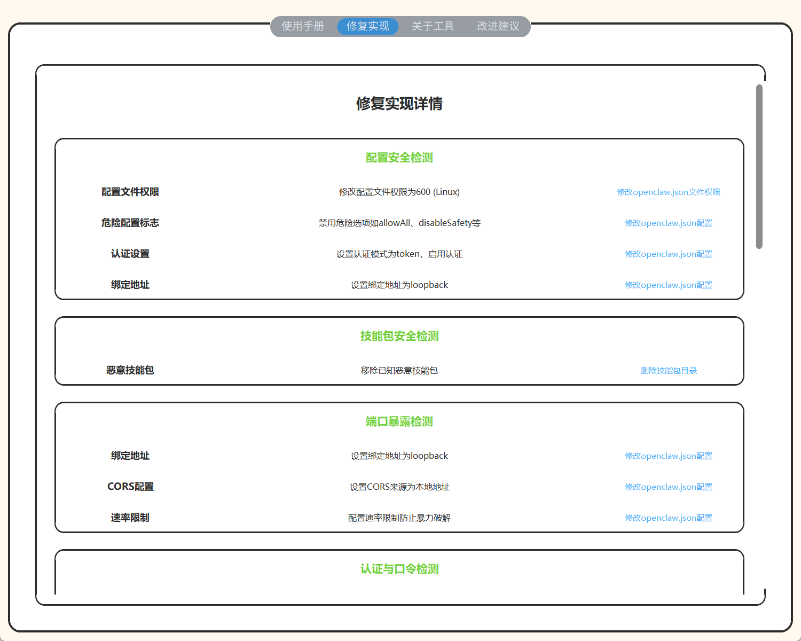
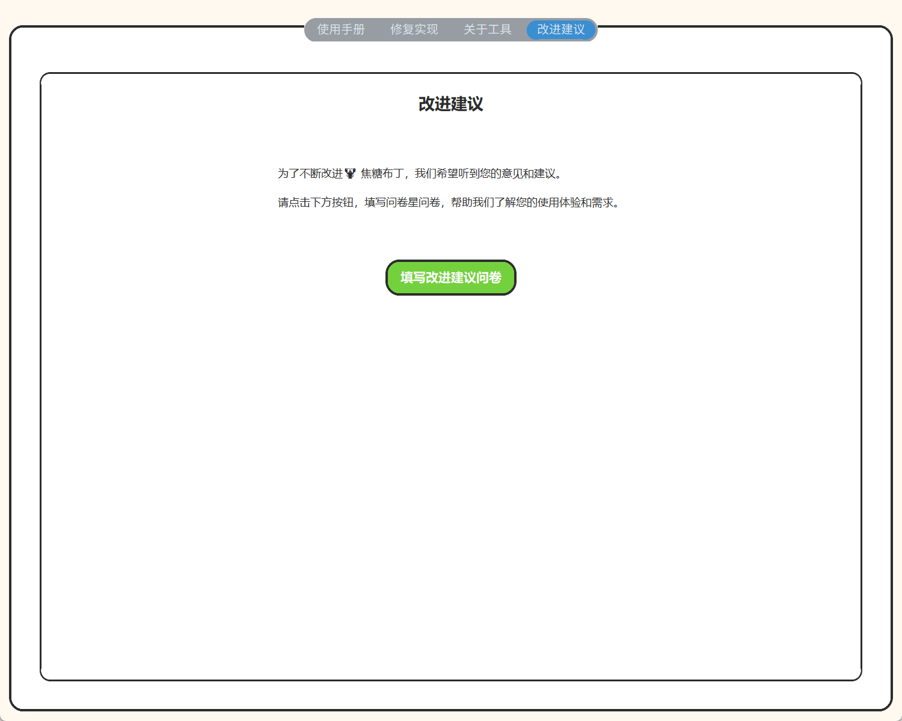

<div align="center">
<h1>🦞 焦糖布丁</h1>
<h3>OpenClaw 基线安全检测工具</h3>

<p>
  <a href="#-快速开始"></a>
  <a href="#-quick-start"></a>
  
  
  
  
  
</p>
<p><em>焦糖布丁（Caramel Pudding）是一款专业的OpenClaw AI Gateway安全基线检测工具，致力于为OpenClaw生态系统提供全面的安全保障。它采用多维度检测策略，深入分析OpenClaw的各个安全层面，帮助用户快速识别并修复潜在的安全风险。<br>Caramel Pudding is a professional security baseline scanning tool for OpenClaw AI Gateway, dedicated to providing comprehensive security assurance for the OpenClaw ecosystem. It employs a multi-dimensional detection strategy to deeply analyze various security aspects of OpenClaw, helping users quickly identify and fix potential security risks.</em></p>

<p><em>该工具集成了10大核心检测模块，包括配置安全、技能包安全、端口暴露、认证口令、依赖供应链、主机安全、密钥泄露、反代配置、运行时检查和数据泄露防护，覆盖了OpenClaw部署的各个安全维度。通过直观的图形界面和详细的修复建议，焦糖布丁使安全审计变得简单高效，即使是非专业安全人员也能轻松操作。<br>The tool integrates 10 core detection modules, including configuration security, skills security, port exposure, authentication, dependency supply chain, host security, secrets leakage, proxy configuration, runtime checks, and data loss prevention, covering all security dimensions of OpenClaw deployment. With its intuitive graphical interface and detailed fix suggestions, Caramel Pudding makes security auditing simple and efficient, even for non-professional security personnel.</em></p>

<p><em>焦糖布丁不仅提供全面的安全检测，还支持一键自动修复功能，帮助用户快速解决安全问题。同时，它生成美观的插画风格HTML报告，详细展示检测结果和修复建议，方便用户进行安全评估和审计。<br>Caramel Pudding not only provides comprehensive security detection but also supports one-click automatic repair functionality to help users quickly resolve security issues. Additionally, it generates beautiful illustration-style HTML reports that detail scan results and fix suggestions, facilitating security assessment and auditing.</em></p>


</div>

---

<!-- TOC -->

- [中文文档](#-中文文档)
  - [功能特性](#功能特性)
  - [系统要求](#系统要求)
  - [快速开始](#-快速开始)
  - [项目结构](#项目结构)
  - [检查模块详解](#检查模块详解)
  - [评分体系](#评分体系)
  - [报告生成](#报告生成)
  - [修复功能](#修复功能)
  - [CI/CD 集成](#cicd-集成)
  - [AI 深度审计](#ai-深度审计)
  - [参与贡献](#参与贡献)
- [English Documentation](#-english-documentation)
  - [Features](#features)
  - [Requirements](#requirements)
  - [Quick Start](#-quick-start)
  - [Project Structure](#project-structure)
  - [Check Modules](#check-modules)
  - [Scoring System](#scoring-system)
  - [Report Generation](#report-generation)
  - [Fix Functionality](#fix-functionality)
  - [CI/CD Integration](#cicd-integration)
  - [AI-Assisted Audit](#ai-assisted-audit)
  - [Contributing](#contributing)
  <!-- /TOC -->

---

# 🇨🇳 中文文档

## 功能特性

| 特性 | 说明 |
|------|------|
| 🔍 **11 大检查模块** | 配置安全 · 技能包安全 · 端口暴露 · 认证口令 · 依赖供应链 · 主机安全 · 密钥泄露 · 反代配置 · 运行时检查 · 数据泄露防护 · 漏洞扫描 |
| 💻 **跨平台支持** | 支持 Windows、Linux、macOS 等多个平台 |
| 🎨 **图形界面** | 直观的 GUI 操作界面，操作简单易用 |
| 🤖 **AI 深度审计** | 提供 AI 深度审计功能，智能分析安全问题 |
| 📊 **量化评分** | 模块加权总评，输出风险等级（LOW / MEDIUM / HIGH / CRITICAL） |
| 🔧 **自动修复** | 一键修复安全问题，支持批量操作 |
| 📄 **多格式报告** | 支持 HTML 和 JSON 格式的报告导出 |
| ⚙️ **CI/CD 友好** | 语义化退出码，适合集成到 CI/CD 流程 |
| 🛠️ **自定义安装路径** | 支持检测自定义安装路径的 OpenClaw |

---

## 系统要求

- **Python 3.8+**
- **Windows 7+ / Linux / macOS**
- **管理员权限**（用于部分系统级检测）
- **依赖库**：
  - customtkinter >= 5.2.0
  - Pillow >= 10.0.0
  - pyyaml >= 6.0.1
  - psutil >= 5.9.0

---

## 🚀 快速开始

### 直接使用可执行文件

1. 从 `build/windows/dist/` 目录下载 `焦糖布丁v1.0.exe`
2. 双击运行可执行文件
3. 在界面中选择 OpenClaw 安装目录
4. 勾选需要检测的安全维度
5. 点击"开始全面检测"按钮启动安全扫描
6. 查看检测结果并导出报告

### 从源码运行

1. 克隆项目到本地
2. 安装依赖：
   ```bash
   pip install -r requirements.txt
   ```
3. 运行主程序：
   ```bash
   python src/main.py
   ```

## 🛠️ 工具使用

### 工具主界面图



### 修复风险功能(部分修复还未能完全实现修复，正在开发中)



### HTML报告



### 漏洞扫描功能



### AI深度审计(后续看情况集成本地模型和云端模型)



### 使用手册



### 修复实现(部分一键修复功能还在开发)



### 关于工具


### 改进建议

---

## 检查模块详解

<details>
<summary><b>配置安全检测（config）</b></summary>

| 检查项 | 说明 | 风险等级 |
|--------|------|---------|
| 配置文件权限 | 检测 openclaw.json 文件权限是否安全 | MEDIUM |
| 危险配置标志 | 检测是否存在危险配置选项如 allowAll、disableSafety 等 | HIGH |
| 认证设置 | 检测认证模式是否启用，是否设置为 token | CRITICAL |
| 绑定地址 | 检测绑定地址是否为 loopback，避免全网暴露 | HIGH |

</details>

<details>
<summary><b>技能包安全检测（skills）</b></summary>

| 检查项 | 说明 | 风险等级 |
|--------|------|---------|
| 恶意技能包 | 检测是否存在已知恶意技能包 | CRITICAL |
| 技能包权限 | 检测技能包文件权限是否安全 | MEDIUM |

</details>

<details>
<summary><b>端口暴露检测（ports）</b></summary>

| 检查项 | 说明 | 风险等级 |
|--------|------|---------|
| 绑定地址 | 检测绑定地址是否为 0.0.0.0，可能导致全网暴露 | CRITICAL |
| CORS 配置 | 检测 CORS 配置是否安全，避免使用通配符 | HIGH |
| 速率限制 | 检测是否配置了速率限制，防止暴力破解 | MEDIUM |

</details>

<details>
<summary><b>认证与口令检测（auth）</b></summary>

| 检查项 | 说明 | 风险等级 |
|--------|------|---------|
| 认证启用 | 检测是否启用了认证功能 | CRITICAL |
| 认证模式 | 检测认证模式是否为 token | CRITICAL |
| 密码强度 | 检测密码强度是否足够 | HIGH |
| JWT Secret | 检测 JWT Secret 是否足够强 | HIGH |
| Token 过期 | 检测 Token 过期时间是否合理 | MEDIUM |
| 速率限制 | 检测是否启用了速率限制 | MEDIUM |

</details>

<details>
<summary><b>依赖供应链检测（deps）</b></summary>

| 检查项 | 说明 | 风险等级 |
|--------|------|---------|
| Node.js 依赖 | 检测 Node.js 依赖是否存在漏洞 | HIGH |
| Python 依赖 | 检测 Python 依赖是否存在漏洞 | MEDIUM |

</details>

<details>
<summary><b>主机安全检测（host）</b></summary>

| 检查项 | 说明 | 风险等级 |
|--------|------|---------|
| 可疑进程 | 检测是否存在可疑进程如挖矿程序、后门等 | CRITICAL |

</details>

<details>
<summary><b>密钥泄露检测（secrets）</b></summary>

| 检查项 | 说明 | 风险等级 |
|--------|------|---------|
| 敏感文件 | 检测是否存在敏感文件如私钥文件等 | CRITICAL |
| 日志清理 | 检测日志文件中是否包含敏感信息 | MEDIUM |

</details>

<details>
<summary><b>反代配置检测（proxy）</b></summary>

| 检查项 | 说明 | 风险等级 |
|--------|------|---------|
| 受信任代理 | 检测受信任代理配置是否安全 | MEDIUM |
| X-Forwarded-For | 检测是否信任 X-Forwarded-For 头 | MEDIUM |
| 安全头 | 检测是否添加了安全头 | LOW |
| 代理链 | 检测代理链配置是否安全 | MEDIUM |

</details>

<details>
<summary><b>运行时检查（runtime）</b></summary>

| 检查项 | 说明 | 风险等级 |
|--------|------|---------|
| 认证模式 | 检测运行时认证模式是否为 token | CRITICAL |
| 命令限制 | 检测是否添加了关键命令限制 | HIGH |
| 会话超时 | 检测会话超时设置是否合理 | MEDIUM |
| 资源限制 | 检测是否配置了内存和 CPU 限制 | LOW |
| 日志配置 | 检测日志级别和日志轮转配置 | LOW |
| 自动更新 | 检测是否启用了自动更新 | LOW |
| 调试模式 | 检测是否关闭了调试模式 | MEDIUM |

</details>

<details>
<summary><b>数据泄露防护检测（dlp）</b></summary>

| 检查项 | 说明 | 风险等级 |
|--------|------|---------|
| 文件哈希基线 | 检测是否创建了文件哈希基线 | MEDIUM |
| Brain/Memory 备份 | 检测是否创建了 Brain/Memory 备份 | MEDIUM |
| 敏感文件 | 检测是否备份并清理了敏感文件 | HIGH |

</details>

<details>
<summary><b>漏洞扫描（vulnerability）</b></summary>

### 支持检测的已知漏洞

#### 1. CVE-2026-25253
- **漏洞类型**：认证令牌窃取
- **风险等级**：CRITICAL（严重）
- **漏洞描述**：当OpenClaw未启用认证模式或令牌存储在内存中时，可能导致未授权访问和令牌窃取
- **检测方法**：
  - 检查openclaw.json中的认证模式配置
  - 检查令牌存储方式
- **修复建议**：
  - 启用认证模式，设置为"token"
  - 更新OpenClaw到最新版本
  - 配置安全的令牌存储方式

#### 2. 默认暴露公网
- **漏洞类型**：网络暴露
- **风险等级**：CRITICAL（严重）
- **漏洞描述**：当绑定地址为0.0.0.0或未设置时，可能导致OpenClaw全网暴露，任何人都可以访问
- **检测方法**：
  - 检查openclaw.json中的绑定地址配置
  - 检查使用的端口是否为常见端口
- **修复建议**：
  - 修改绑定地址为"loopback"或"lan"
  - 配置防火墙规则限制访问
  - 启用认证保护

#### 3. 插件投毒
- **漏洞类型**：供应链攻击
- **风险等级**：HIGH（高危）
- **漏洞描述**：技能包来源不明或使用宽松依赖版本，可能导致恶意代码注入
- **检测方法**：
  - 检查技能包的作者信息
  - 检查技能包的依赖版本配置
- **修复建议**：
  - 只使用来自可信来源的技能包
  - 运行`openclaw skills verify`验证技能包
  - 定期更新技能包

#### 4. 权限失控
- **漏洞类型**：权限提升
- **风险等级**：HIGH（高危）
- **漏洞描述**：未配置权限控制或启用allowAll权限，可能导致权限提升和未授权操作
- **检测方法**：
  - 检查openclaw.json中的权限配置
  - 检查管理员和用户权限设置
- **修复建议**：
  - 配置权限控制
  - 禁用allowAll权限
  - 遵循最小权限原则

#### 5. 架构缺陷
- **漏洞类型**：架构安全
- **风险等级**：CRITICAL（严重）
- **漏洞描述**：沙箱未启用、网络未隔离、资源未限制，可能导致安全边界被突破
- **检测方法**：
  - 检查openclaw.json中的架构配置
  - 检查沙箱、网络隔离和资源限制设置
- **修复建议**：
  - 启用沙箱
  - 配置网络隔离
  - 设置资源限制

#### 6. 版本漏洞
- **漏洞类型**：版本安全
- **风险等级**：HIGH（高危）
- **漏洞描述**：当前OpenClaw版本存在已知安全漏洞
- **检测方法**：
  - 检查package.json中的版本信息
  - 对比已知漏洞版本列表
- **修复建议**：
  - 更新OpenClaw到最新版本
  - 定期检查安全公告

</details>

---

## 评分体系

各模块按权重加权计算总评分，输出风险等级：

| 风险等级 | 说明 | CI/CD 建议 |
|---------|------|-----------|
| ✅ LOW RISK | 低风险，安全配置良好 | 允许自动部署 |
| ⚠️ MEDIUM RISK | 中风险，存在一些安全问题 | 人工审核后部署 |
| ❌ HIGH RISK | 高风险，存在严重安全问题 | 阻断部署 |
| 🚨 CRITICAL RISK | 严重风险，存在致命安全问题 | 立即阻断，通知安全团队 |

---

## 报告生成

扫描完成后，您可以导出两种格式的报告：

| 报告格式 | 说明 | 特点 |
|---------|------|------|
| **HTML 报告** | 包含详细的检测结果、风险等级、修复建议等 | 美观易读，适合人工查看 |
| **JSON 报告** | 结构化的检测结果数据 | 适合自动化处理和集成到其他系统 |

HTML 报告采用插画风格设计，包含完整的检测结果和修复建议，方便您快速了解系统安全状态。


---

## 修复功能

对于检测到的安全问题，您可以：

1. 在结果表格中选择需要修复的风险项（支持多选）
2. 点击"修复选中风险"按钮
3. 在弹出的对话框中查看修复操作详情
4. 点击"执行修复"按钮进行修复
5. 修复完成后，工具会自动重新扫描以更新结果

**修复操作说明**：
- 对于低风险和中风险的问题，工具会尝试自动修复
- 对于高风险和严重风险的问题，工具会提供修复建议，需要人工确认后执行

---

## AI 深度审计

焦糖布丁提供 AI 深度审计功能，利用 AI 对检测结果进行更深入的分析：

1. 点击界面中的"AI 深度审计"按钮
2. 工具会将检测结果生成AI提示词模板，然后将模板发给AI来进行详细的分析
3. AI 会提供更详细的安全建议和修复方案
4. 您可以根据 AI 的建议进行进一步的安全加固

## 免责声明

工具修复方案和内容仅供参考，由于传播、利用此工具所提供的信息而造成的任何直接或者间接的后果及损失，均由使用者本人负责，作者不为此承担任何责任。

## Star History

<a href="https://www.star-history.com/?repos=EdinLyle%2FCaramel-Pudding&type=date&legend=top-left">
 <picture>
   <source media="(prefers-color-scheme: dark)" srcset="https://api.star-history.com/image?repos=EdinLyle/Caramel-Pudding&type=date&theme=dark&legend=top-left" />
   <source media="(prefers-color-scheme: light)" srcset="https://api.star-history.com/image?repos=EdinLyle/Caramel-Pudding&type=date&legend=top-left" />
   
 </picture>
</a>

## 许可证

[MIT License](https://github.com/EdinLyle/Caramel-Pudding/blob/master/LICENSE)) 

---

# 🇬🇧 English Documentation

## Features

| Feature | Description |
|---------|-------------|
| 🔍 **11 Check Modules** | config · skills · ports · auth · deps · host · secrets · proxy · runtime · dlp · vulnerability |
| 💻 **Cross-Platform** | Supports Windows, Linux, macOS |
| 🎨 **GUI Interface** | Intuitive graphical user interface, easy to use |
| 🤖 **AI-Assisted Audit** | AI-powered deep security analysis |
| 📊 **Quantified Scoring** | Weighted scoring with risk levels (LOW / MEDIUM / HIGH / CRITICAL) |
| 🔧 **Auto-Fix** | One-click remediation of security issues, support batch operations |
| 📄 **Multi-Format Reports** | HTML and JSON report export |
| ⚙️ **CI/CD Ready** | Semantic exit codes for CI/CD integration |
| 🛠️ **Custom Installation Path** | Supports detection of custom OpenClaw installations |

---

## Requirements

- **Python 3.8+**
- **Windows 7+ / Linux / macOS**
- **Administrator privileges** (for system-level checks)
- **Dependencies**:
  - customtkinter >= 5.2.0
  - Pillow >= 10.0.0
  - pyyaml >= 6.0.1
  - psutil >= 5.9.0

---

## 🚀 Quick Start

### Using the Executable

1. Download `焦糖布丁v1.0.exe` from the `build/windows/dist/` directory
2. Double-click to run the executable
3. Select the OpenClaw installation directory in the interface
4. Check the security dimensions to scan
5. Click "开始全面检测" (Start Full Scan) to launch the security scan
6. View the results and export reports

### Running from Source

1. Clone the project to your local machine
2. Install dependencies:
   ```bash
   pip install -r requirements.txt
   ```
3. Run the main program:
   ```bash
   python src/main.py
   ```

## Tool Usage

### Main Interface


### Fix Risk Functionality (Some fixes are still in development)


### HTML Report


### AI Deep Audit


### User Manual


### Fix Implementation (Some one-click fixes are still in development)


### About Tool


### Improvement Suggestions


---

## Check Modules

| Module | Key Areas |
|--------|-----------|
| **config** | Configuration file permissions, dangerous flags, authentication settings, bind address |
| **skills** | Malicious skills detection, skills permissions |
| **ports** | Port binding, CORS configuration, rate limiting |
| **auth** | Authentication enablement, auth mode, password strength, JWT secret, token expiration |
| **deps** | Node.js dependency vulnerabilities, Python dependency vulnerabilities |
| **host** | Suspicious processes detection |
| **secrets** | Sensitive files detection, log cleaning |
| **proxy** | Trusted proxies, X-Forwarded-For, security headers, proxy chain |
| **runtime** | Auth mode, command restrictions, session timeout, resource limits, logging, auto-update, debug mode |
| **dlp** | File hash baseline, Brain/Memory backup, sensitive files |
| **vulnerability** | CVE-2026-25253 (authentication token theft), default public exposure, plugin poisoning, permission escalation, architecture flaws, version vulnerabilities |

---

## Scoring System

| Risk Level | Description | CI/CD Action |
|------------|-------------|-------------|
| ✅ LOW RISK | Low risk, good security configuration | Allow automated deployment |
| ⚠️ MEDIUM RISK | Medium risk, some security issues | Manual review before deployment |
| ❌ HIGH RISK | High risk, serious security issues | Block deployment |
| 🚨 CRITICAL RISK | Critical risk, fatal security issues | Immediate block + notify security team |

---

## Report Generation

After scanning, you can export reports in two formats:

| Report Format | Description | Features |
|---------------|-------------|----------|
| **HTML Report** | Detailed scan results, risk levels, fix suggestions | Beautiful and easy to read, suitable for manual review |
| **JSON Report** | Structured scan result data | Suitable for automated processing and integration |

The HTML report uses an illustration style design, including complete scan results and fix suggestions, making it easy to quickly understand the system security status.

---

## Fix Functionality

For detected security issues, you can:

1. Select the risk items to fix in the results table (multi-select supported)
2. Click the "修复选中风险" (Fix Selected Risks) button
3. View the fix operation details in the pop-up dialog
4. Click "执行修复" (Execute Fix) to perform the fix
5. After fixing, the tool will automatically rescan to update the results

**Fix Operation Notes**:
- For low and medium risk issues, the tool will attempt to fix them automatically
- For high and critical risk issues, the tool will provide fix suggestions that require manual confirmation

---

## AI-Assisted Audit (Local and cloud models integration planned for future)

焦糖布丁 provides AI-assisted audit functionality to perform deeper analysis of scan results:

1. Click the "AI 深度审计" (AI Deep Audit) button in the interface
2. The tool will generate an AI prompt template from the scan results and send it to AI for detailed analysis
3. AI will provide more detailed security recommendations and fix solutions
4. You can follow AI's suggestions for further security hardening

---

## Disclaimer

The tool's fix solutions and content are for reference only. The author is not responsible for any direct or indirect consequences and losses caused by the dissemination or use of the information provided by this tool. The user assumes full responsibility.

## Star History

<a href="https://www.star-history.com/?repos=EdinLyle%2FCaramel-Pudding&type=date&legend=top-left">
 <picture>
   <source media="(prefers-color-scheme: dark)" srcset="https://api.star-history.com/image?repos=EdinLyle/Caramel-Pudding&type=date&theme=dark&legend=top-left" />
   <source media="(prefers-color-scheme: light)" srcset="https://api.star-history.com/image?repos=EdinLyle/Caramel-Pudding&type=date&legend=top-left" />
   
 </picture>
</a>

## License

[MIT License](https://github.com/EdinLyle/Caramel-Pudding/blob/master/LICENSE)

---

<div align="center">
<sub>Built for the OpenClaw AI Gateway ecosystem · Designed with security-first principles</sub>
</div>